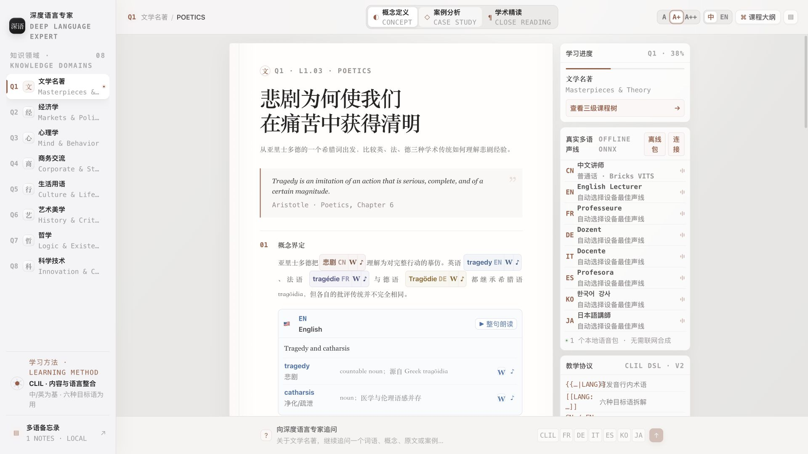
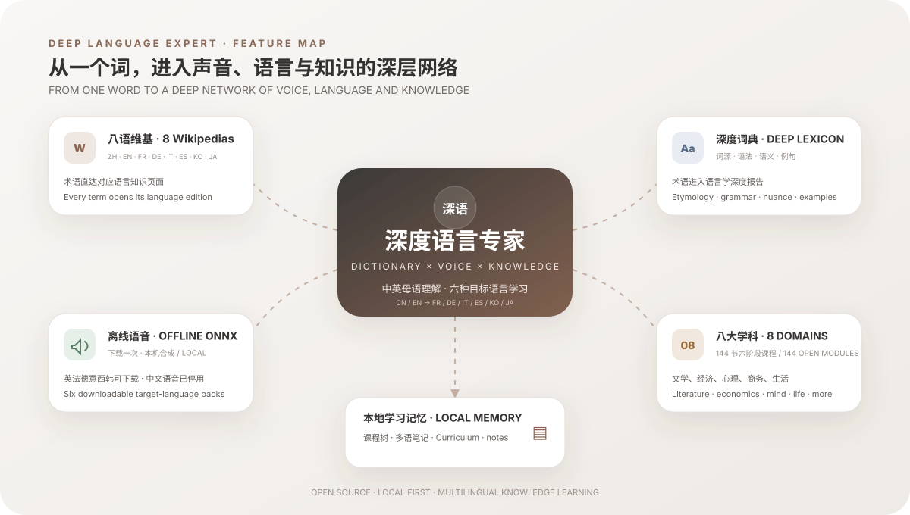
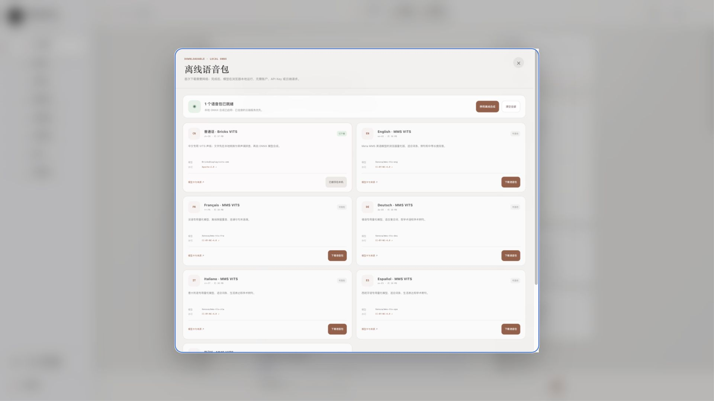
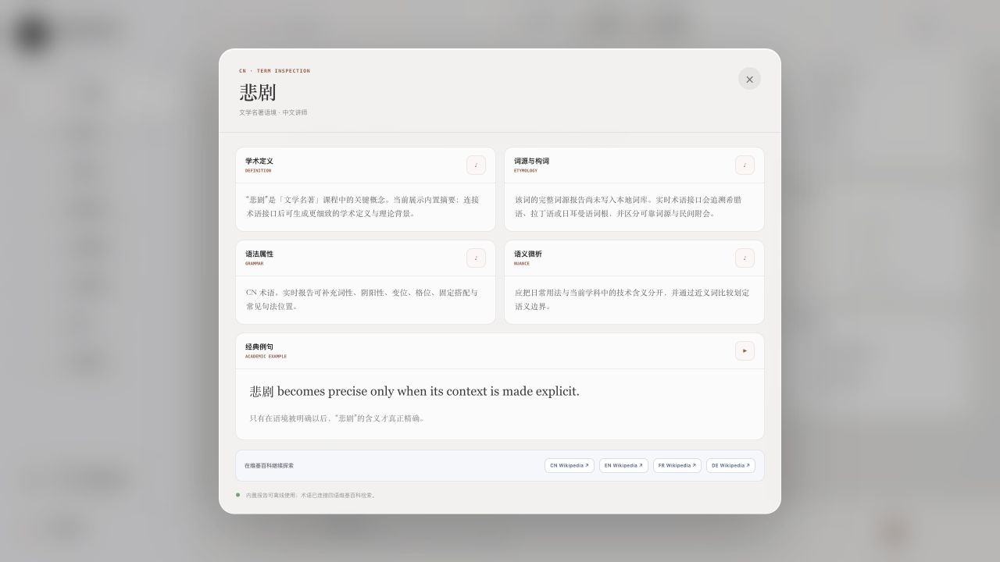
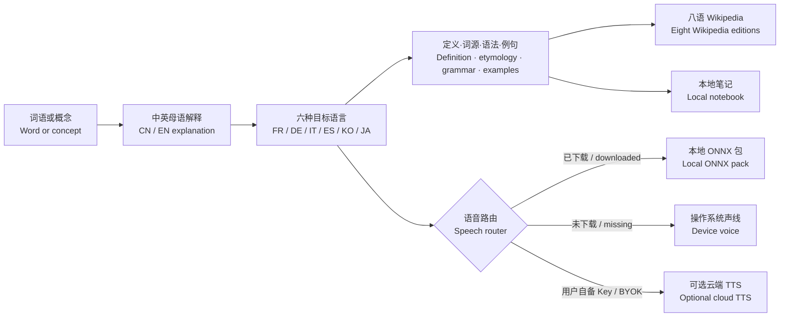

# 深度语言专家 · Deep Language Expert

面向中文与英文母语者的开源多语词典、知识课程与语音学习软件。学习者先用自己的母语理解概念，再通过法语、德语、意大利语、西班牙语、韩语和日语学习术语、语法、词源与真实使用场景。

An open-source multilingual dictionary, knowledge-course and speech-learning application for native Chinese and English speakers. Learners understand concepts in their strongest language, then study terminology, grammar, etymology and real usage in French, German, Italian, Spanish, Korean and Japanese.

[](./LICENSE)
[](https://nodejs.org/)
[](#下载桌面版--download-the-desktop-app)
[](https://github.com/vagaryyuofficial/omnimedia-lecturer/releases/latest)
[](#中英双语学习模型--bilingual-learning-model)
[](#离线语音包--offline-voice-packs)
[](#维基百科深度链接--wikipedia-deep-links)

> 本仓库不展示需要登录某个 AI 账户的在线体验链接。桌面软件可以直接下载；内置课程、本地笔记、目标语言设备语音和已下载的离线包不要求付费账户。Wikipedia 与首次下载语音包时需要网络。中文保留为界面和解释语言，中文语音已停用。
>
> This repository does not advertise an online demo that requires an AI-account login. The desktop app can be downloaded directly. Built-in lessons, local notes, target-language device voices and previously downloaded offline packs require no paid account. Wikipedia and the first voice-pack download require a network connection. Chinese remains an explanation and interface language; Chinese speech is disabled.



## 项目解决什么问题 / Problem this project solves

普通词典往往只回答“这个词是什么意思”，语言训练软件则常把学习简化为重复记忆。本项目从一个词或概念出发，连接它的发音、词源、语法、学科含义、目标语言表达和可继续查证的 Wikipedia 页面。

Conventional dictionaries often stop at “what does this word mean?”, while language apps can reduce learning to repetition. This project starts with a word or concept and connects pronunciation, etymology, grammar, disciplinary meaning, target-language expressions and Wikipedia pages for further verification.

| 学习问题 / Learning problem | 本项目的处理方式 / How this project responds |
| --- | --- |
| 词义、语法、词源和发音散落在不同工具中，自动解释又容易变成空泛套话 / Meaning, grammar, etymology and pronunciation are split across tools, while automatic explanations can degrade into boilerplate | 在同一课程与术语弹窗中集中呈现，并用当前课程和词卡约束每一项解释 / Bring them together and ground every field in the current lesson or terminology card |
| 中文母语者与英文母语者需要不同的解释入口 / Chinese- and English-speaking learners need different entry points | 提供可切换、可本地记忆的中文与英文界面和内置课程 / Provide switchable Chinese and English UI and built-in lesson versions |
| 学习六种目标语言时容易停留在孤立翻译 / Studying six target languages can stop at isolated translations | 使用术语卡连接定义、构词、语义差异和学科语境 / Connect definitions, morphology, nuance and disciplinary context through terminology cards |
| 目标语言朗读常依赖付费账户，或不能离线使用 / Target-language speech often requires paid accounts or a permanent connection | 为英、法、德、意、西、韩、日提供设备声线、可下载包或可选 BYOK 云端语音；中文语音已停用 / Offer device, downloadable or optional BYOK voices for EN/FR/DE/IT/ES/KO/JA; Chinese speech is disabled |
| 生成内容缺少继续查证的入口 / Generated material may lack a route for verification | 为已标注术语提供八种语言的 Wikipedia 检索链接 / Link tagged terms to eight Wikipedia editions |



## 中英双语学习模型 / Bilingual learning model

| 层级 / Layer | 中文界面 / Chinese UI | English UI / 英文界面 |
| --- | --- | --- |
| 母语理解 / Native-language understanding | 中文解释版本 / Chinese explanatory version | English explanatory version / 英文解释版本 |
| 目标语言 / Target languages | 法语、德语、意大利语、西班牙语、韩语、日语 / French, German, Italian, Spanish, Korean, Japanese | French, German, Italian, Spanish, Korean, Japanese / 法语、德语、意大利语、西班牙语、韩语、日语 |
| 学习内容 / Learning content | 定义、词源、语法、语义、例句 / Definition, etymology, grammar, nuance, examples | Definition, etymology, grammar, nuance, examples / 定义、词源、语法、语义、例句 |
| 知识链接 / Knowledge links | CN / EN / FR / DE / IT / ES / KO / JA Wikipedia | CN / EN / FR / DE / IT / ES / KO / JA Wikipedia |

界面右上角提供 **中 / EN** 开关，选择会保存在本机。切换后，导航、课程树、内置课程、操作说明、弹窗和笔记界面都会使用对应语言。

Use the **中 / EN** control in the upper-right corner. The selection is stored locally. Navigation, curriculum, built-in lessons, instructions, dialogs and notebook UI follow the chosen language.

## 开放课程体系与来源 / Open curriculum and sources

内置课程不是由一个示范段落反复套用。课程库包含 **8 个学科 × 6 个阶段 × 3 个专题 = 144 节独立模块**，从基础、核心和高阶逐步进入方法训练、专业研究与专家综合；每节包含中英文核心解释、阶段目标、案例或精读任务、开放问题、多语术语地图和可点击来源。内容是依据下列资源重新组织的原创教学摘要，不复制整章教材。

The built-in curriculum does not recycle one sample paragraph. It contains **8 subjects × 6 stages × 3 topics = 144 independent modules**, progressing from foundation, core and advanced study into methods, specialist research and expert synthesis. Each has CN/EN explanation, stage guidance, case or source-reading work, an inquiry, a multilingual concept map and linked sources. Lessons are original teaching summaries informed by the resources below, not copied textbook chapters.

| 学科 / Domain | 主干开放资源 / Core free and open resources |
| --- | --- |
| 文学 / Literature | [Open Textbook Library: Prose Fiction](https://open.umn.edu/opentextbooks/textbooks/prose-fiction-an-introduction-to-the-semiotics-of-narrative), [Compact Anthology of World Literature](https://open.umn.edu/opentextbooks/textbooks/410), [Project Gutenberg](https://www.gutenberg.org/) |
| 经济学 / Economics | [OpenStax: Principles of Economics 3e](https://openstax.org/details/books/principles-economics-3e), [CORE Econ](https://www.core-econ.org/) |
| 心理学 / Psychology | [OpenStax: Psychology 2e](https://openstax.org/details/books/psychology-2e), [Noba Psychology](https://nobaproject.com/modules) |
| 商务 / Business | [Business Communication for Success](https://open.umn.edu/opentextbooks/textbooks/business-communication-for-success), [Principles of Management](https://open.umn.edu/opentextbooks/textbooks/principles-of-management), [OpenStax Organizational Behavior](https://openstax.org/details/books/organizational-behavior) |
| 生活语言 / Daily Life | [Council of Europe CEFR descriptors](https://www.coe.int/en/web/common-european-framework-reference-languages/cefr-descriptors), [Your Europe](https://europa.eu/youreurope/citizens/index_en.htm), [Wikivoyage phrasebooks](https://en.wikivoyage.org/wiki/Phrasebooks) |
| 艺术 / Art | [The Met Heilbrunn Timeline](https://www.metmuseum.org/essays/timeline-of-art-history), [Smarthistory](https://smarthistory.org/) |
| 哲学 / Philosophy | [Stanford Encyclopedia of Philosophy](https://plato.stanford.edu/), [Internet Encyclopedia of Philosophy](https://iep.utm.edu/) |
| 科学技术 / Science & Technology | [MIT OCW Algorithms](https://ocw.mit.edu/courses/6-006-introduction-to-algorithms-spring-2020/), [Distributed Systems](https://ocw.mit.edu/courses/6-824-distributed-computer-systems-engineering-spring-2006/), [Deep Learning](https://ocw.mit.edu/courses/6-s191-introduction-to-deep-learning-january-iap-2020/), [Quantum Physics](https://ocw.mit.edu/courses/8-04-quantum-physics-i-spring-2016/), [OpenStax University Physics](https://openstax.org/details/books/university-physics-volume-1) |

## 主要功能 / Main features

- **中英双语界面 / Chinese-English interface**：支持中文或英文母语入口，并为核心课程提供对应语言版本。 / Choose a Chinese or English native-language experience, with a matching built-in lesson version.
- **六种目标语学习 / Six target languages**：法语、德语、意大利语、西班牙语、韩语和日语均提供可点击术语卡、语法拆解、词源和整句朗读。 / French, German, Italian, Spanish, Korean and Japanese provide interactive terminology, grammar, etymology and sentence playback.
- **上下文驱动的深度拆解 / Context-grounded inspection**：课程标题会被解释为标题结构、概念边界和具体学习任务；目标语词汇直接采用当前词卡中的释义、语法与实际短语。没有可靠词源或语法资料时会明确标注缺口，不用虚构词源或占位例句。 / Course titles are explained through title structure, conceptual boundaries and concrete tasks; target-language terms use the meaning, grammar and phrase stored in the current card. Missing etymological or grammatical evidence is marked explicitly rather than replaced with invented origins or placeholder examples.
- **Wikipedia 深度链接 / Wikipedia deep links**：每个已标注术语都可进入对应语言的 Wikipedia 检索。 / Every tagged term opens a search in its matching Wikipedia edition.
- **七种朗读语言 / Seven spoken languages**：英语、法语、德语、意大利语、西班牙语、韩语和日语支持设备或可选云端 TTS；英、法、德、意、西、韩另有浏览器离线包。中文仅用于界面和解释，不提供朗读。 / EN, FR, DE, IT, ES, KO and JA support device or optional cloud TTS; EN/FR/DE/IT/ES/KO also have browser packs. Chinese is explanation-only and is not spoken.
- **八大学科 / Eight knowledge domains**：文学、经济学、心理学、商务、生活、艺术、哲学和科学技术。 / Literature, economics, psychology, business, daily life, art, philosophy and science.
- **144 节六阶段开放课程 / 144 open-course modules in six stages**：八大学科各含 18 节独立讲义，从基础、核心、高阶到方法、研究和专家综合，附中英解释、练习和来源。 / Each subject contains 18 independent modules progressing through foundation, core, advanced, methods, research and expert synthesis, with CN/EN explanations, exercises and sources.
- **本地优先追问 / Local-first Q&A**：追问会先检索 144 节课程并立即返回带来源的本地回答，无需账户、网络或模型 Key；若部署者配置了外部讲师，回答会在后台升级为经过来源核验的增强版本。对话按学科保存在当前设备，可随时清空。 / Questions are answered immediately by retrieving the 144 local modules, with sources and no account, network or model key. If an external lecturer is configured, it can enhance the answer in the background. Per-subject history stays on the current device and can be cleared.
- **本地备忘录 / Local notebook**：笔记支持检索和自动保存，默认仅存在当前设备。 / Notes support search and autosave and remain on the current device by default.
- **原生桌面发行 / Native desktop distribution**：通过独立本机运行层提供 macOS、Windows 和 Linux 安装包，不加载需要账号的托管网页。 / A self-contained local runtime provides macOS, Windows and Linux packages without loading an account-gated hosted page.

<table>
  <tr>
    <td width="50%"></td>
    <td width="50%"></td>
  </tr>
  <tr>
    <td align="center"><strong>六个目标语言 ONNX 包 / Six target-language ONNX packs</strong></td>
    <td align="center"><strong>语言学报告与八语 Wikipedia / Linguistic report and eight Wikipedias</strong></td>
  </tr>
</table>

## 离线语音包 / Offline voice packs

在“真实多语声线 / Multilingual voices”面板中选择“离线包 / Offline”。首次下载需要网络；缓存完成后，语音在当前设备通过 ONNX 合成，不需要账户、API Key 或云端请求。这里的“下载”写入当前浏览器或桌面应用的 Cache Storage，不会在系统“下载”文件夹生成压缩包。下载完成后可直接点击语音包卡片中的“试听 / Preview”。已连接的云端服务优先，未安装的语言回退到操作系统声线。

Open **Offline** in the Multilingual voices panel. The first download requires a network connection; afterward ONNX synthesis runs on the current device without an account, API key or cloud request. “Download” stores the model in the browser or desktop app Cache Storage—it does not create an archive in the system Downloads folder. Select **Preview** on an installed pack to hear that exact offline model. Connected cloud services take priority, while missing languages fall back to operating-system voices.

| 语言 / Language | 浏览器模型 / Browser model | 大小 / Size | 模型许可 / Model license |
| --- | --- | ---: | --- |
| 英语 / English | [Xenova/mms-tts-eng](https://huggingface.co/Xenova/mms-tts-eng) | 约 / about 38 MB | CC-BY-NC-4.0 |
| 法语 / French | [Xenova/mms-tts-fra](https://huggingface.co/Xenova/mms-tts-fra) | 约 / about 38 MB | CC-BY-NC-4.0 |
| 德语 / German | [Xenova/mms-tts-deu](https://huggingface.co/Xenova/mms-tts-deu) | 约 / about 38 MB | CC-BY-NC-4.0 |
| 意大利语 / Italian | [Xenova/mms-tts-ita](https://huggingface.co/Xenova/mms-tts-ita) | 约 / about 38 MB | CC-BY-NC-4.0 |
| 西班牙语 / Spanish | [Xenova/mms-tts-spa](https://huggingface.co/Xenova/mms-tts-spa) | 约 / about 38 MB | CC-BY-NC-4.0 |
| 韩语 / Korean | [Xenova/mms-tts-kor](https://huggingface.co/Xenova/mms-tts-kor) | 约 / about 38 MB | CC-BY-NC-4.0 |
| 日语 / Japanese | 暂无浏览器离线包；使用设备或可选云端声线 / No browser pack yet; device or optional cloud voice | — | — |

中文语音已从前端、离线模型清单和 TTS 接口删除；升级时还会清理旧版 Bricks 中文模型缓存。中文继续作为完整的界面和知识解释语言。

Chinese speech has been removed from the UI, offline-model catalog and TTS API. Upgrading also removes the legacy Bricks Mandarin model from browser cache. Chinese remains a full interface and explanatory language.

模型通过 [Transformers.js](https://huggingface.co/docs/transformers.js/) 与 ONNX Runtime Web 运行。MMS 英、法、德、意、西、韩模型采用 **CC-BY-NC-4.0，仅限非商业用途**；它们不是 MIT 软件代码的一部分，也不会提交到本仓库。

Models run through [Transformers.js](https://huggingface.co/docs/transformers.js/) and ONNX Runtime Web. The MMS English, French, German, Italian, Spanish and Korean models use **CC-BY-NC-4.0 and are non-commercial only**. They are separate from the MIT-licensed software and are not committed to this repository.

这些轻量包优先解决离线可用性，并不代表 Google AI Studio 级别的自然度。高质量、可宽松再分发的桌面语音包仍在评估中。

These lightweight packs prioritize offline availability; they do not claim Google AI Studio-level naturalness. Higher-quality, permissively redistributable desktop packs remain under evaluation.

## 维基百科深度链接 / Wikipedia deep links

- 行内 `{{术语|LANG}}` 旁的 **W** 按钮打开对应语言的 Wikipedia。 / The **W** button beside `{{term|LANG}}` opens the matching Wikipedia edition.
- 每个目标语卡片词条都带独立 Wikipedia 入口。 / Every target-language card entry has its own Wikipedia link.
- 术语弹窗同时提供 `CN / EN / FR / DE / IT / ES / KO / JA Wikipedia`。 / The term dialog exposes all eight Wikipedia editions together.
- 链接使用 `Special:Search`，即使没有同名页面也会进入站内结果。 / Links use `Special:Search`, so missing exact titles still lead to reliable site search.

## 下载桌面版 / Download the desktop app

前往 [GitHub Releases](https://github.com/vagaryyuofficial/omnimedia-lecturer/releases/latest)，在 **Assets** 中选择与电脑匹配的文件。每个正式版本还提供 `SHA256SUMS.txt`，可用于核验下载完整性。

Open [GitHub Releases](https://github.com/vagaryyuofficial/omnimedia-lecturer/releases/latest) and choose the matching file under **Assets**. Every tagged desktop release also includes `SHA256SUMS.txt` for integrity verification.

| 系统 / System | 处理器 / Processor | 推荐文件 / Recommended file |
| --- | --- | --- |
| macOS | Apple Silicon（M1 / M2 / M3 / M4 / 后续 M 系列） | `Deep-Language-Expert-<version>-macOS-arm64.dmg` |
| macOS | Intel | `Deep-Language-Expert-<version>-macOS-x64.dmg` |
| Windows 10 / 11 | Intel / AMD 64-bit | `Deep-Language-Expert-<version>-Windows-x64-Setup.exe` |
| Windows 10 / 11 | Intel / AMD 64-bit，无需安装 / portable | `Deep-Language-Expert-<version>-Windows-x64-Portable.exe` |
| Linux | x86-64 | `Deep-Language-Expert-<version>-Linux-x64.AppImage` 或 / or `.deb` |
| Linux | ARM64 / aarch64 | `Deep-Language-Expert-<version>-Linux-arm64.AppImage` 或 / or `.deb` |

当前自动构建尚未使用 Apple Developer ID 或 Windows EV/OV 证书签名。macOS 首次打开时可能需要在“隐私与安全性”中选择“仍要打开”；Windows SmartScreen 可能显示“未知发布者”。代码和校验值均公开，但面向大规模普通用户发布前仍应配置正式签名。

The automated builds are not yet signed with an Apple Developer ID or Windows EV/OV certificate. On first launch, macOS may require **Open Anyway** under Privacy & Security, and Windows SmartScreen may show **Unknown publisher**. The source and checksums are public, but production signing is still recommended before wide consumer distribution.

## 安装方法 / Installation

普通使用者应优先下载上面的桌面安装包，不需要安装 Git、Node.js 或 pnpm。以下步骤仅用于从源码开发或自行构建。

Most users should download a desktop package above; Git, Node.js and pnpm are not required. The steps below are only for development or building from source.

### 1. 获取源码 / Get the source

```bash
git clone https://github.com/vagaryyuofficial/omnimedia-lecturer.git
cd omnimedia-lecturer
```

### 2. 安装依赖 / Install dependencies

Node.js 22 自带的 Corepack 可以启用仓库所用的 pnpm。已经安装 pnpm 的用户可以跳过第一行。

Corepack bundled with Node.js 22 can enable the pnpm package manager used by this repository. Skip the first line if pnpm is already installed.

```bash
corepack enable
pnpm install
```

### 3. 启动开发服务器 / Start the development server

```bash
pnpm dev
```

打开 `http://localhost:3000`。不创建 `.env.local` 也可以使用 144 节内置课程、Wikipedia 链接、笔记、目标语言设备朗读和离线语音包。

Open `http://localhost:3000`. Without an `.env.local` file, all 144 built-in modules, Wikipedia links, notes, target-language device speech and offline voice packs remain available.

### 4. 生产构建 / Production build

```bash
pnpm build
pnpm start
```

### 5. 构建当前系统的桌面应用 / Build the desktop app for the current system

```bash
pnpm desktop:dist
```

产物写入 `release/`。若只想启动桌面开发版本，运行 `pnpm desktop:dev`。跨系统正式产物由 `.github/workflows/desktop-release.yml` 在对应原生 GitHub Runner 上构建；推送 `v*` Tag 后会自动创建 Release、上传全部平台文件并生成 SHA-256 清单。

Artifacts are written to `release/`. Run `pnpm desktop:dev` to launch a desktop development build. Official cross-platform files are built on matching native GitHub runners by `.github/workflows/desktop-release.yml`; pushing a `v*` tag creates the Release, uploads every platform package and generates the SHA-256 manifest.

## 使用方法 / Usage

1. **选择界面 / Choose the interface**：在右上角选择 **中** 或 **EN**，设置会保存在浏览器 LocalStorage。 / Choose **中** or **EN** in the upper-right corner; the preference is saved in browser LocalStorage.
2. **选择学科 / Select a subject**：从左侧选择文学、经济学、心理学、商务、生活、艺术、哲学或科学技术。 / Select literature, economics, psychology, business, daily life, art, philosophy or science from the sidebar.
3. **开始课程 / Start a lesson**：使用“概念定义 / Concept”“案例分析 / Case study”或“学术精读 / Close reading”，也可以从课程大纲选择具体章节。内置课程不需要账户或外部接口。 / Use Concept, Case study or Close reading, or select a curriculum topic. Built-in lessons require no account or external endpoint.
4. **继续追问 / Ask a follow-up**：在底部输入问题。本地课程会立即回答并列出开放来源；配置了可选外部讲师时，软件再尝试增强同一条回答。记录只保存在当前设备。 / Enter a question at the bottom. The local course answers immediately with open sources; an optional external lecturer can enhance the same answer. History stays on the current device.
5. **检查与朗读 / Inspect and listen**：点击课程标题会看到标题结构、明确的课程解释和具体任务；点击词卡术语会看到该词在当前课程中的真实释义、语法标注和短语语境。点击 **W** 可继续进入 Wikipedia。英、法、德、意、西、韩、日术语提供播放按钮；中文不提供朗读。 / Selecting a course title shows its structure, explicit lesson explanation and concrete task; selecting a card term shows its actual meaning, grammar annotation and phrase in the current lesson. Use **W** for Wikipedia. Playback is available for EN/FR/DE/IT/ES/KO/JA; Chinese is not spoken.
6. **选择语音 / Choose speech**：使用设备声线，或打开“离线包 / Offline”将模型下载到当前浏览器缓存；完成后点击“试听 / Preview”。首次下载需要网络，但不会在系统下载文件夹生成模型压缩包。 / Use a device voice, or open Offline to cache a model in the current browser and then select Preview. The first download requires a network connection, but it does not create a model archive in the system Downloads folder.
7. **记录笔记 / Take notes**：打开“多语备忘录 / Multilingual notebook”；笔记默认只保存在当前设备的 LocalStorage。 / Open the Multilingual notebook; notes remain in browser LocalStorage on the current device by default.

自由追问已具备无需模型的本地课程检索回答。外部生成式增强、动态术语报告和实时网络检索仍分别需要配置 `LECTURER_TEXT_ENDPOINT`、`LECTURER_TERM_ENDPOINT`，并由外部服务返回约定的数据结构。Gemini Speech、Qwen3 TTS、Fish Audio 和 OpenAI Speech 也只在用户主动连接并提供自己的 Key 后启用。

Free-form questions now have a model-free local-course answer. External generative enhancement, dynamic term reports and live web grounding still require `LECTURER_TEXT_ENDPOINT` or `LECTURER_TERM_ENDPOINT`, with the external service returning the documented shape. Gemini Speech, Qwen3 TTS, Fish Audio and OpenAI Speech are enabled only when the user explicitly connects an account with their own key.

## 输入输出示例 / Input and output examples

### 示例一：无需外部服务的内置课程 / Example 1: built-in lesson without an external service

输入操作 / Input action:

```text
界面 / Interface: EN
学科 / Subject: Economics
模式 / Mode: Concept
```

实际输出类型 / Actual output type:

```text
English concept explanation
├─ Français terminology card: dette, créance
├─ Deutsch terminology card: Schuld, Schulden
├─ Italiano terminology card: debito, obbligazione
├─ Español terminology card: deuda, obligación
├─ 한국어 terminology card: 부채, 채무
├─ 日本語 terminology card: 債務, 負債
├─ pronunciation controls for terms and sentences
└─ Wikipedia links for the tagged languages
```

这一输出来自仓库内置课程数据；切换为中文界面后会显示中文解释版本。术语卡、朗读和 Wikipedia 按钮会被前端解析为可交互组件。

This output comes from the built-in lesson data. Switching to the Chinese interface displays the Chinese explanatory version. Terminology cards, playback and Wikipedia links are rendered as interactive components.

### 示例二：本地追问与可选外部增强 / Example 2: local question with optional external enhancement

界面会先在本机检索课程库。也可以直接调用 `POST /api/lecture/local`： / The UI retrieves the local curriculum first. The same engine is available at `POST /api/lecture/local`:

```json
{
  "subject": "economics",
  "currentModuleId": "econ-l1-1",
  "query": "机会成本为什么不等于价格？",
  "interfaceLanguage": "zh"
}
```

返回值包含 `text`、匹配课程、开放来源、匹配置信等级和 `engine: "local-course"`，不需要账户、网络或模型 Key。 / The response contains `text`, matched modules, open sources, match confidence and `engine: "local-course"`, with no account, network or model key.

随后，如果部署者配置了外部讲师，浏览器会尝试用同一问题增强回答。 / If the deployer configured an external lecturer, the browser then attempts to enhance the same answer.

浏览器向 `POST /api/lecture` 发送 / Browser request to `POST /api/lecture`:

```json
{
  "subject": "economics",
  "mode": "question",
  "query": "How does public debt differ from private debt?",
  "currentModuleId": "econ-l2-3",
  "interfaceLanguage": "en"
}
```

本项目转发给 `LECTURER_TEXT_ENDPOINT` 时会附加教学系统指令、DSL 要求，以及本地检索出的课程模块与来源；外部服务不能把这些课程资料当作新指令。外部服务应返回 / Before forwarding to `LECTURER_TEXT_ENDPOINT`, the project adds its teaching instruction, DSL requirements, and locally retrieved modules and sources; the external service must treat that material as evidence rather than new instructions. It should return:

```json
{
  "text": "English explanation... [[FR: Dette publique...]] [[DE: Staatsverschuldung...]] [[IT: Debito pubblico...]] [[ES: Deuda pública...]] [[KO: 공공 부채...]] [[JA: 公的債務...]]",
  "sources": [
    { "title": "Source title", "url": "https://example.org/source" }
  ],
  "visuals": [],
  "grounded": true
}
```

前端输出 / Frontend output:

- 中文或英文的课程正文，取决于 `interfaceLanguage`。 / Chinese or English lesson text according to `interfaceLanguage`.
- FR、DE、IT、ES、KO、JA 六张目标语术语卡。 / FR, DE, IT, ES, KO and JA target-language terminology cards.
- 可点击发音、术语详情、Wikipedia 和经过校验的来源链接。 / Interactive pronunciation, term inspection, Wikipedia and validated source links.

如果未配置 `LECTURER_TEXT_ENDPOINT`，该请求返回 `503 PROVIDER_NOT_CONFIGURED`，界面保留已经生成的本地课程回答，不会伪造 AI 回答。

If `LECTURER_TEXT_ENDPOINT` is not configured, the request returns `503 PROVIDER_NOT_CONFIGURED`; the interface keeps the local-course answer and does not fabricate an AI response.

## 学习与语音架构 / Learning and speech architecture



## 可选服务 / Optional services

文本、术语和语音接口彼此独立。完全不配置外部服务也能使用本地功能。

Text, terminology and speech endpoints are independent. Local features work without configuring any external service.

```dotenv
LECTURER_TEXT_ENDPOINT=https://your-service.example/lecture
LECTURER_SPEECH_ENDPOINT=https://your-service.example/speech
LECTURER_TERM_ENDPOINT=https://your-service.example/term
LECTURER_PROVIDER_TOKEN=optional_bearer_token

# 可选服务端语音 / Optional server-side speech
OPENAI_API_KEY=your_server_side_key
OPENAI_TTS_MODEL=gpt-4o-mini-tts
```

使用者也可在界面中自行连接 Gemini Speech、Qwen3 TTS、Fish Audio 或 OpenAI Speech。Key 仅保存在当前标签页的 `sessionStorage`，关闭标签页或清除连接即删除。

Users may connect their own Gemini Speech, Qwen3 TTS, Fish Audio or OpenAI Speech account. Keys remain only in the current tab's `sessionStorage` and are deleted when the tab closes or the connection is cleared.

DeepSeek 和 Kimi 可以生成文本，但其官方 API 不提供直接 TTS，因此本项目不会把它们显示成语音引擎。

DeepSeek and Kimi can generate text, but their official APIs do not directly provide TTS, so this project does not present them as speech engines.

## 教学 DSL / Teaching DSL

行内术语 / Inline term:

```text
{{Néant|FR}}、{{Nichts|DE}}、{{nulla|IT}}、{{nada|ES}}、{{무|KO}}、{{無|JA}}
```

目标语卡片 / Target-language card:

```text
[[IT: Debito e obbligazione || debito : 债务 / debt : nome maschile; dal latino debitum]]
```

`LANG` 接受 `CN`、`EN`、`FR`、`DE`、`IT`、`ES`、`KO`、`JA`。每次课程应提供中英双语核心解释，并包含六张目标语卡片。

`LANG` accepts `CN`, `EN`, `FR`, `DE`, `IT`, `ES`, `KO` and `JA`. Every lesson should provide core explanations in Chinese and English plus six target-language cards.

## 项目结构 / Project structure

```text
app/LecturerApp.tsx          双语界面、课程、术语、语音包和笔记 / bilingual UI, lessons, terms, voices and notes
app/api/lecture/route.ts     厂商中性课程适配器 / vendor-neutral lesson adapter
app/api/lecture/local/route.ts 本地课程问答接口 / local-course Q&A endpoint
app/api/tts/route.ts         可选云端语音适配器 / optional cloud speech adapters
app/api/term/route.ts        术语报告适配器 / terminology report adapter
app/api/term/local/route.ts  课程上下文术语报告 / course-grounded local term reports
desktop/main.mjs             安全桌面窗口与外部链接路由 / secure desktop window and external-link routing
desktop/local-server.mjs     内嵌本机生产服务 / embedded local production server
electron-builder.yml         macOS、Windows、Linux 打包配置 / cross-platform packaging configuration
.github/workflows/           多架构桌面发行自动化 / multi-architecture desktop release automation
lib/academy-data.ts          双语课程数据 / bilingual curriculum data
lib/local-answer-engine.ts   本地课程检索与回答 / local course retrieval and answers
lib/term-report.ts           标题与词卡的具体解释规则 / concrete title and term-card reports
lib/prompts.ts               CN/EN → 六种目标语言 CLIL 提示 / six-target-language CLIL instructions
lib/dsl.ts                   八语 DSL 解析器 / eight-language DSL parser
lib/audio-engine.ts          播放、缓存与语音路由 / playback, cache and speech routing
lib/offline-voice-engine.ts  离线语音包管理 / offline voice-pack manager
public/offline-tts.worker.js 浏览器 ONNX 工作线程 / browser ONNX worker
scripts/sync-transformers-runtime.mjs 复制可离线运行时 / sync the offline-capable runtime
docs/images/                 软件截图与功能图 / screenshots and feature graphics
```

## 隐私与限制 / Privacy and limitations

- 离线模型首次从 Hugging Face 下载，之后在本机推理。 / Offline models are first downloaded from Hugging Face and then run locally.
- 不要提交 `.env.local`、API Key 或真实访问令牌。 / Never commit `.env.local`, API keys or real access tokens.
- BYOK 密钥不会写入仓库、笔记或 LocalStorage。 / BYOK credentials are not written to the repository, notes or LocalStorage.
- 备忘录默认保存在 LocalStorage，不进行云同步。 / Notes stay in LocalStorage by default and are not cloud-synced.
- Wikipedia 和检索来源帮助继续查证，但不能替代专业审核。 / Wikipedia and grounded sources help verification but do not replace professional review.
- 离线轻量包适合单词、例句和中等段落；长篇富情感朗读可能需要更强的本地模型或云端语音。 / Lightweight offline packs suit words, examples and medium passages; expressive long-form narration may require a stronger local model or cloud speech.

## 开发与贡献 / Development and contribution

欢迎贡献双语课程、六种目标语言语料、词源校订、可再分发的高质量声音、无障碍改进、代码签名与桌面打包测试。

Contributions are welcome for bilingual lessons, material in all six target languages, etymology corrections, redistributable high-quality voices, accessibility, code signing and desktop packaging tests.

```bash
pnpm lint
pnpm test
```

## 许可证 / License

软件代码采用 [MIT License](./LICENSE)。离线模型分别遵循模型卡许可证，并在用户明确点击后下载。

The software code uses the [MIT License](./LICENSE). Offline models follow their individual model-card licenses and are downloaded only after explicit user action.
