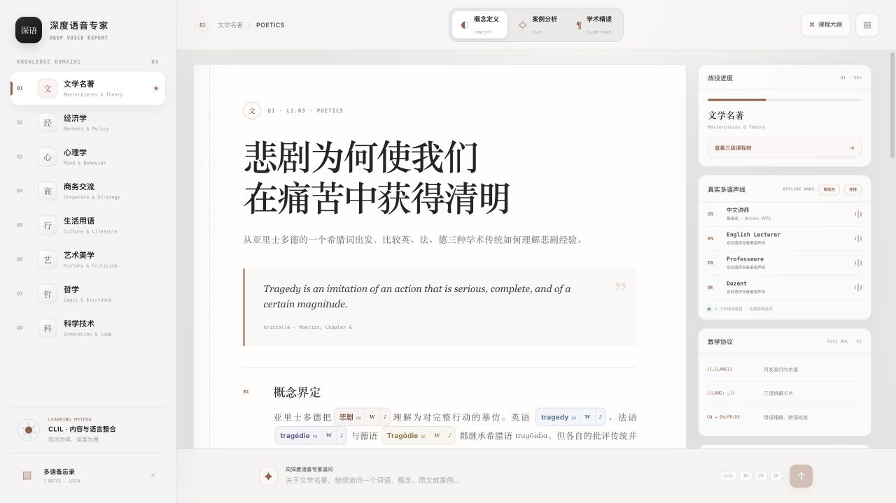
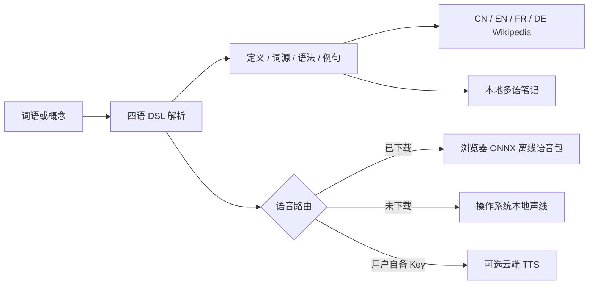

# 深度语音专家 · Deep Voice Expert

一款面向深度学习的开源多语词典与语音学习软件。它把词典、CLIL 课程、四语发音、词源分析和维基百科知识网络放进同一个界面：从一个词出发，理解它在中文、英语、法语和德语中的声音、语法、历史与学术含义。

[](./LICENSE)
[](https://nodejs.org/)
[](#离线语音包)
[](#维基百科深度链接)

> 本仓库不提供必须登录某个 AI 账户的“在线体验”入口。软件可下载、可自行运行；内置课程、术语报告、维基链接、笔记与设备语音不依赖付费账户。



## 它解决什么问题

普通词典只告诉你“这个词是什么意思”，普通语言应用只训练重复记忆。深度语音专家希望回答更深的问题：这个词为什么这样发音？它从哪里来？在不同语言和学科中，它的边界是否相同？我如何从词条继续进入可靠的知识页面？


## 核心功能

- **词典式深度拆解**：定义、词源、构词、语法、语义微析、经典例句和中文译文集中呈现。
- **CN / EN / FR / DE 四语学习**：中文负责建立概念，英语、法语和德语负责校准术语边界与学术语感。
- **可点击、可朗读、可追溯**：行内术语、卡片词条和整句都能独立朗读；每个已标注词条都带维基百科入口。
- **离线语音包**：中、英、法、德模型按需下载到浏览器缓存，在本机通过 ONNX 推理生成语音。
- **八大学科知识领域**：文学、经济学、心理学、商务交流、生活用语、艺术美学、哲学和科学技术。
- **阶段化课程树**：每个学科包含 L1 基础、L2 核心和 L3 高阶课程。
- **本地笔记**：双栏备忘录支持搜索和自动保存，数据默认只存在当前设备。
- **可选云端语音**：使用者可以自行连接 Gemini、Qwen3、Fish Audio 或 OpenAI；API Key 只保存在当前标签页会话中。

<table>
  <tr>
    <td width="50%"></td>
    <td width="50%"></td>
  </tr>
  <tr>
    <td align="center"><strong>可下载的本地 ONNX 语音包</strong></td>
    <td align="center"><strong>语言学报告与四语 Wikipedia 深度链接</strong></td>
  </tr>
</table>

## 离线语音包

进入右侧“真实多语声线”面板，点击 **离线包**，即可按语言下载。首次下载需要网络；模型成功缓存后，文本合成在当前设备完成，不需要登录、API Key 或云端请求。云端语音连接存在时，云端服务优先；未安装的语言会继续使用操作系统声线。

| 语言 | 浏览器模型 | 量化包体积 | 模型许可 |
| --- | --- | ---: | --- |
| 中文 | [BricksDisplay/vits-cmn](https://huggingface.co/BricksDisplay/vits-cmn) | 约 37 MB | Apache-2.0 |
| 英语 | [Xenova/mms-tts-eng](https://huggingface.co/Xenova/mms-tts-eng) | 约 38 MB | CC-BY-NC-4.0 |
| 法语 | [Xenova/mms-tts-fra](https://huggingface.co/Xenova/mms-tts-fra) | 约 38 MB | CC-BY-NC-4.0 |
| 德语 | [Xenova/mms-tts-deu](https://huggingface.co/Xenova/mms-tts-deu) | 约 38 MB | CC-BY-NC-4.0 |

模型由 [Transformers.js](https://huggingface.co/docs/transformers.js/) 与 ONNX Runtime Web 在浏览器内执行。中文模型采用 Apache-2.0；MMS 英、法、德模型采用 **CC-BY-NC-4.0，仅限非商业用途**。模型许可与本项目的 MIT 代码许可相互独立，下载界面会逐项显示来源和许可证。

缓存位置由浏览器管理。应用内的“清空全部”会删除 `transformers-cache` 与本地安装状态；用户也可以通过浏览器的站点数据设置清理模型。

## 维基百科深度链接

应用不会把 Wikipedia 当作一张孤立的来源卡片，而是把它嵌入词典交互：

- `{{术语|LANG}}` 行内术语旁的 **W** 按钮，进入相同语言的 Wikipedia 检索。
- 三语词汇卡中的每一个拆解词条，都带对应语言的 Wikipedia 入口。
- 术语深度弹窗同时提供 `CN / EN / FR / DE Wikipedia` 四个入口，便于比较不同语言知识页面的关注点。
- 所有链接使用 Wikipedia 的 `Special:Search`，即使没有完全同名页面，也会进入可靠的站内检索结果。

## 下载与运行

支持 Windows、macOS 与 Linux。当前版本以开源 Web 应用源码发布，需要 Node.js 22.13 或更高版本；可以从 GitHub 的 **Releases** 下载源码压缩包，或克隆仓库：

```bash
git clone https://github.com/vagaryyuofficial/omnimedia-lecturer.git
cd omnimedia-lecturer
pnpm install
pnpm dev
```

打开 `http://localhost:3000`。不创建 `.env.local` 也可以使用内置课程、课程树、术语报告、维基链接、备忘录、设备朗读与可下载离线语音包。

生产构建：

```bash
pnpm build
pnpm start
```

> 当前 Release 的“Source code”可跨平台运行，但还不是 Windows `.exe`、macOS `.dmg` 或 Linux `.AppImage` 一键安装包。原生桌面封装计划采用 Tauri，在发布前会继续保留这一说明，避免把源码包误称为桌面安装器。

## 学习与语音架构



## 可选：实时内容与云端语音

项目的文本、术语与语音接口彼此独立。你可以连接自有服务，也可以只使用完全本地的内置能力：

```dotenv
LECTURER_TEXT_ENDPOINT=https://your-service.example/lecture
LECTURER_SPEECH_ENDPOINT=https://your-service.example/speech
LECTURER_TERM_ENDPOINT=https://your-service.example/term
LECTURER_PROVIDER_TOKEN=optional_bearer_token

# 可选服务端 OpenAI Speech
OPENAI_API_KEY=your_server_side_key
OPENAI_TTS_MODEL=gpt-4o-mini-tts
```

界面也允许使用者自行连接 Gemini Speech、Qwen3 TTS、Fish Audio S2 Pro 或 OpenAI Speech。浏览器端 Key 只保存在当前标签页的 `sessionStorage`，关闭标签页即清除；请只在自己信任的部署中输入 Key，并避免朗读敏感信息。

项目不会把 DeepSeek 或 Kimi 冒充成语音引擎：它们可以生成文本，但官方 API 没有直接 TTS 输出。

## 教学 DSL

行内术语：

```text
{{Es|DE}}、{{Id|EN}}、{{ça|FR}}
```

多语卡片：

```text
[[DE: Es, Ich und Über-Ich || Es : 本我 : neuter pronoun used as noun ;; Ich : 自我 : nominalized pronoun]]
```

`LANG` 只接受 `CN`、`EN`、`FR` 或 `DE`。实时内容应以中文为正文主体，并至少提供 EN、FR、DE 三张术语卡。

## 项目结构

```text
app/LecturerApp.tsx          主界面、课程树、术语弹窗、语音包与备忘录
app/api/lecture/route.ts     厂商中性的实时课程与视觉资料适配器
app/api/tts/route.ts         Gemini / Qwen / Fish Audio / OpenAI 云端适配器
app/api/term/route.ts        深度术语报告适配器
lib/academy-data.ts          八大学科、三级课程、内置讲义与视觉资料
lib/prompts.ts               CLIL 核心系统指令与学科上下文
lib/dsl.ts                   行内术语与多语卡片 DSL 解析器
lib/audio-engine.ts          单例播放、音频解码、缓存与语音路由
lib/offline-voice-engine.ts  离线语音包状态、下载缓存与本地合成接口
lib/offline-tts.worker.ts    Transformers.js / ONNX 浏览器工作线程
docs/images/                 真实软件截图与功能地图
```

## 隐私、安全与限制

- 离线模型在浏览器本地推理；首次下载时会从 Hugging Face 获取模型文件。
- 不要提交 `.env.local`、API Key 或真实访问令牌。
- 浏览器会话中的自带 Key 不会写入仓库、笔记或 LocalStorage。
- 备忘录默认保存在 LocalStorage，不进行云同步。
- Wikipedia 与检索 grounding 能帮助继续查证，但不能代替专业审核。
- 当前离线包侧重清晰的单词、例句和中等长度段落；长篇富情感朗读仍可能优先选择高质量云端语音。

## 开发与贡献

欢迎贡献新的课程语料、更精确的词源说明、可再分发的高质量离线声线、无障碍改进和桌面安装包。提交前请运行：

```bash
pnpm lint
pnpm test
```

## 许可证

软件代码采用 [MIT License](./LICENSE)。离线模型分别遵循其模型卡所列许可；模型不会打包进本仓库，而是在用户明确点击下载后获取。
