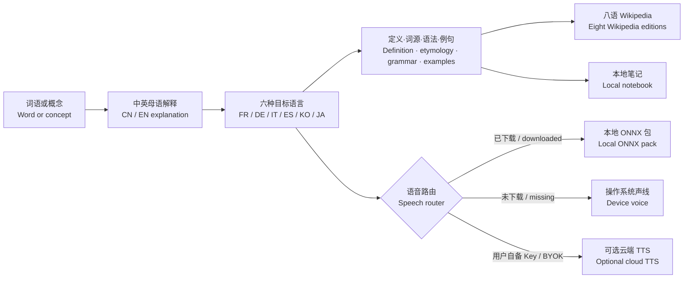

# 深度语言专家 · Deep Language Expert

面向中文与英文母语者的开源多语词典、知识课程与语音学习软件。学习者先用自己的母语理解概念，再通过法语、德语、意大利语、西班牙语、韩语和日语学习术语、语法、词源与真实使用场景。

An open-source multilingual dictionary, knowledge-course and speech-learning application for native Chinese and English speakers. Learners understand concepts in their strongest language, then study terminology, grammar, etymology and real usage in French, German, Italian, Spanish, Korean and Japanese.

[](./LICENSE)
[](https://nodejs.org/)
[](#中英双语学习模型--bilingual-learning-model)
[](#离线语音包--offline-voice-packs)
[](#维基百科深度链接--wikipedia-deep-links)

> 本仓库不展示需要登录某个 AI 账户的在线体验链接。软件可以下载和自行运行；内置课程、Wikipedia 链接、本地笔记、设备语音和按需下载的离线包不要求付费账户。
>
> This repository does not advertise an online demo that requires an AI-account login. The software can be downloaded and self-hosted. Built-in lessons, Wikipedia links, local notes, device voices and downloadable offline packs require no paid account.


## 项目解决什么问题 / Problem this project solves

普通词典往往只回答“这个词是什么意思”，语言训练软件则常把学习简化为重复记忆。本项目从一个词或概念出发，连接它的发音、词源、语法、学科含义、目标语言表达和可继续查证的 Wikipedia 页面。

Conventional dictionaries often stop at “what does this word mean?”, while language apps can reduce learning to repetition. This project starts with a word or concept and connects pronunciation, etymology, grammar, disciplinary meaning, target-language expressions and Wikipedia pages for further verification.

| 学习问题 / Learning problem | 本项目的处理方式 / How this project responds |
| --- | --- |
| 词义、语法、词源和发音散落在不同工具中 / Meaning, grammar, etymology and pronunciation are split across tools | 在同一课程与术语弹窗中集中呈现 / Bring them together in lessons and term-inspection dialogs |
| 中文母语者与英文母语者需要不同的解释入口 / Chinese- and English-speaking learners need different entry points | 提供可切换、可本地记忆的中文与英文界面和内置课程 / Provide switchable Chinese and English UI and built-in lesson versions |
| 学习六种目标语言时容易停留在孤立翻译 / Studying six target languages can stop at isolated translations | 使用术语卡连接定义、构词、语义差异和学科语境 / Connect definitions, morphology, nuance and disciplinary context through terminology cards |
| 朗读功能常依赖付费账户，或不能离线使用 / Speech often requires paid accounts or a permanent connection | 提供设备声线、可下载的浏览器离线包，以及可选的用户自备 Key 云端语音 / Offer device voices, downloadable browser packs and optional BYOK cloud speech |
| 生成内容缺少继续查证的入口 / Generated material may lack a route for verification | 为已标注术语提供八种语言的 Wikipedia 检索链接 / Link tagged terms to eight Wikipedia editions |


## 中英双语学习模型 / Bilingual learning model

| 层级 / Layer | 中文界面 / Chinese UI | English UI / 英文界面 |
| --- | --- | --- |
| 母语理解 / Native-language understanding | 中文解释版本 / Chinese explanatory version | English explanatory version / 英文解释版本 |
| 目标语言 / Target languages | 法语、德语、意大利语、西班牙语、韩语、日语 / French, German, Italian, Spanish, Korean, Japanese | French, German, Italian, Spanish, Korean, Japanese / 法语、德语、意大利语、西班牙语、韩语、日语 |
| 学习内容 / Learning content | 定义、词源、语法、语义、例句 / Definition, etymology, grammar, nuance, examples | Definition, etymology, grammar, nuance, examples / 定义、词源、语法、语义、例句 |
| 知识链接 / Knowledge links | CN / EN / FR / DE / IT / ES / KO / JA Wikipedia | CN / EN / FR / DE / IT / ES / KO / JA Wikipedia |

界面右上角提供 **中 / EN** 开关，选择会保存在本机。切换后，导航、课程树、内置课程、操作说明、弹窗和笔记界面都会使用对应语言。

Use the **中 / EN** control in the upper-right corner. The selection is stored locally. Navigation, curriculum, built-in lessons, instructions, dialogs and notebook UI follow the chosen language.

## 主要功能 / Main features

- **中英双语界面 / Chinese-English interface**：支持中文或英文母语入口，并为核心课程提供对应语言版本。 / Choose a Chinese or English native-language experience, with a matching built-in lesson version.
- **六种目标语学习 / Six target languages**：法语、德语、意大利语、西班牙语、韩语和日语均提供可点击术语卡、语法拆解、词源和整句朗读。 / French, German, Italian, Spanish, Korean and Japanese provide interactive terminology, grammar, etymology and sentence playback.
- **词典式深度拆解 / Dictionary-grade inspection**：集中呈现定义、构词、语义微析、学术例句与译文。 / Inspect definitions, word formation, nuance, academic examples and translations.
- **Wikipedia 深度链接 / Wikipedia deep links**：每个已标注术语都可进入对应语言的 Wikipedia 检索。 / Every tagged term opens a search in its matching Wikipedia edition.
- **八语语音路由 / Eight-language speech routing**：八种语言都支持设备与可选云端 TTS；除日语外，另有按需下载的浏览器离线包。 / All eight languages support device and optional cloud TTS; all except Japanese also have downloadable browser packs.
- **八大学科 / Eight knowledge domains**：文学、经济学、心理学、商务、生活、艺术、哲学和科学技术。 / Literature, economics, psychology, business, daily life, art, philosophy and science.
- **三级课程树 / Three-level curriculum**：每个学科包含基础、核心和高阶路径。 / Every subject includes foundation, core and advanced paths.
- **本地备忘录 / Local notebook**：笔记支持检索和自动保存，默认仅存在当前设备。 / Notes support search and autosave and remain on the current device by default.

<table>
  <tr>
    <td width="50%"></td>
    <td width="50%"></td>
  </tr>
  <tr>
    <td align="center"><strong>七个可下载 ONNX 语音包 / Seven downloadable ONNX voice packs</strong></td>
    <td align="center"><strong>语言学报告与八语 Wikipedia / Linguistic report and eight Wikipedias</strong></td>
  </tr>
</table>

## 离线语音包 / Offline voice packs

在“真实多语声线 / Multilingual voices”面板中选择“离线包 / Offline”。首次下载需要网络；缓存完成后，语音在当前设备通过 ONNX 合成，不需要账户、API Key 或云端请求。已连接的云端服务优先，未安装的语言回退到操作系统声线。

Open **Offline** from the Multilingual voices panel. The first download needs a network connection; after caching, ONNX synthesis runs on the current device without an account, API key or cloud request. A connected cloud provider takes priority, while missing languages fall back to operating-system voices.

| 语言 / Language | 浏览器模型 / Browser model | 大小 / Size | 模型许可 / Model license |
| --- | --- | ---: | --- |
| 中文 / Chinese | [BricksDisplay/vits-cmn](https://huggingface.co/BricksDisplay/vits-cmn) | 约 / about 37 MB | Apache-2.0 |
| 英语 / English | [Xenova/mms-tts-eng](https://huggingface.co/Xenova/mms-tts-eng) | 约 / about 38 MB | CC-BY-NC-4.0 |
| 法语 / French | [Xenova/mms-tts-fra](https://huggingface.co/Xenova/mms-tts-fra) | 约 / about 38 MB | CC-BY-NC-4.0 |
| 德语 / German | [Xenova/mms-tts-deu](https://huggingface.co/Xenova/mms-tts-deu) | 约 / about 38 MB | CC-BY-NC-4.0 |
| 意大利语 / Italian | [Xenova/mms-tts-ita](https://huggingface.co/Xenova/mms-tts-ita) | 约 / about 38 MB | CC-BY-NC-4.0 |
| 西班牙语 / Spanish | [Xenova/mms-tts-spa](https://huggingface.co/Xenova/mms-tts-spa) | 约 / about 38 MB | CC-BY-NC-4.0 |
| 韩语 / Korean | [Xenova/mms-tts-kor](https://huggingface.co/Xenova/mms-tts-kor) | 约 / about 38 MB | CC-BY-NC-4.0 |
| 日语 / Japanese | 暂无浏览器离线包；使用设备或可选云端声线 / No browser pack yet; device or optional cloud voice | — | — |

模型通过 [Transformers.js](https://huggingface.co/docs/transformers.js/) 与 ONNX Runtime Web 运行。MMS 英、法、德、意、西、韩模型采用 **CC-BY-NC-4.0，仅限非商业用途**；它们不是 MIT 软件代码的一部分，也不会提交到本仓库。

Models run through [Transformers.js](https://huggingface.co/docs/transformers.js/) and ONNX Runtime Web. The MMS English, French, German, Italian, Spanish and Korean models use **CC-BY-NC-4.0 and are non-commercial only**. They are separate from the MIT-licensed software and are not committed to this repository.

这些轻量包优先解决离线可用性，并不代表 Google AI Studio 级别的自然度。高质量、可宽松再分发的桌面语音包仍在评估中。

These lightweight packs prioritize offline availability; they do not claim Google AI Studio-level naturalness. Higher-quality, permissively redistributable desktop packs remain under evaluation.

## 维基百科深度链接 / Wikipedia deep links

- 行内 `{{术语|LANG}}` 旁的 **W** 按钮打开对应语言的 Wikipedia。 / The **W** button beside `{{term|LANG}}` opens the matching Wikipedia edition.
- 每个目标语卡片词条都带独立 Wikipedia 入口。 / Every target-language card entry has its own Wikipedia link.
- 术语弹窗同时提供 `CN / EN / FR / DE / IT / ES / KO / JA Wikipedia`。 / The term dialog exposes all eight Wikipedia editions together.
- 链接使用 `Special:Search`，即使没有同名页面也会进入站内结果。 / Links use `Special:Search`, so missing exact titles still lead to reliable site search.

## 安装方法 / Installation

支持 Windows、macOS 和 Linux。当前版本以跨平台 Web 应用源码发布，需要 [Git](https://git-scm.com/)、Node.js 22.13 或更高版本，以及 pnpm。

Windows, macOS and Linux are supported. The current release is distributed as cross-platform Web application source and requires [Git](https://git-scm.com/), Node.js 22.13 or later, and pnpm.

### 1. 获取源码 / Get the source

```bash
git clone https://github.com/vagaryyuofficial/omnimedia-lecturer.git
cd omnimedia-lecturer
```

### 2. 安装依赖 / Install dependencies

Node.js 22 自带的 Corepack 可以启用仓库所用的 pnpm。已经安装 pnpm 的用户可以跳过第一行。

Corepack bundled with Node.js 22 can enable the pnpm package manager used by this repository. Skip the first line if pnpm is already installed.

```bash
corepack enable
pnpm install
```

### 3. 启动开发服务器 / Start the development server

```bash
pnpm dev
```

打开 `http://localhost:3000`。不创建 `.env.local` 也可以使用内置课程、Wikipedia 链接、笔记、设备朗读和离线语音包。

Open `http://localhost:3000`. Without an `.env.local` file, built-in lessons, Wikipedia links, notes, device speech and offline voice packs remain available.

### 4. 生产构建 / Production build

```bash
pnpm build
pnpm start
```

> GitHub Release 的 Source code 可跨平台运行，但还不是 `.exe`、`.dmg` 或 `.AppImage` 一键安装器。桌面封装发布前会持续明确标注，避免把源码包误称为安装包。
>
> GitHub Release source archives run cross-platform, but they are not yet one-click `.exe`, `.dmg` or `.AppImage` installers. Releases will keep this distinction explicit until desktop packaging is complete.

## 使用方法 / Usage

1. **选择界面 / Choose the interface**：在右上角选择 **中** 或 **EN**，设置会保存在浏览器 LocalStorage。 / Choose **中** or **EN** in the upper-right corner; the preference is saved in browser LocalStorage.
2. **选择学科 / Select a subject**：从左侧选择文学、经济学、心理学、商务、生活、艺术、哲学或科学技术。 / Select literature, economics, psychology, business, daily life, art, philosophy or science from the sidebar.
3. **开始课程 / Start a lesson**：使用“概念定义 / Concept”“案例分析 / Case study”或“学术精读 / Close reading”，也可以从课程大纲选择具体章节。内置课程不需要账户或外部接口。 / Use Concept, Case study or Close reading, or select a curriculum topic. Built-in lessons require no account or external endpoint.
4. **检查与朗读 / Inspect and listen**：点击术语查看定义、词源、语法和例句；点击 **W** 打开对应 Wikipedia；点击播放按钮朗读。 / Select a term to inspect its definition, etymology, grammar and examples; use **W** for Wikipedia and the play control for speech.
5. **选择语音 / Choose speech**：使用设备声线，或打开“离线包 / Offline”下载本地语音；首次下载需要网络。 / Use a device voice or open Offline to download a local pack; the initial download requires a network connection.
6. **记录笔记 / Take notes**：打开“多语备忘录 / Multilingual notebook”；笔记默认只保存在当前设备的 LocalStorage。 / Open the Multilingual notebook; notes remain in browser LocalStorage on the current device by default.

自由提问、动态术语报告和实时检索不是内置生成模型。它们分别需要配置 `LECTURER_TEXT_ENDPOINT`、`LECTURER_TERM_ENDPOINT`，并由外部服务返回约定的数据结构。Gemini Speech、Qwen3 TTS、Fish Audio 和 OpenAI Speech 也只在用户主动连接并提供自己的 Key 后启用。

Free-form questions, dynamic term reports and live grounding are not generated by a bundled model. They require `LECTURER_TEXT_ENDPOINT` or `LECTURER_TERM_ENDPOINT`, with the external service returning the documented shape. Gemini Speech, Qwen3 TTS, Fish Audio and OpenAI Speech are enabled only when the user explicitly connects an account with their own key.

## 输入输出示例 / Input and output examples

### 示例一：无需外部服务的内置课程 / Example 1: built-in lesson without an external service

输入操作 / Input action:

```text
界面 / Interface: EN
学科 / Subject: Economics
模式 / Mode: Concept
```

实际输出类型 / Actual output type:

```text
English concept explanation
├─ Français terminology card: dette, créance
├─ Deutsch terminology card: Schuld, Schulden
├─ Italiano terminology card: debito, obbligazione
├─ Español terminology card: deuda, obligación
├─ 한국어 terminology card: 부채, 채무
├─ 日本語 terminology card: 債務, 負債
├─ pronunciation controls for terms and sentences
└─ Wikipedia links for the tagged languages
```

这一输出来自仓库内置课程数据；切换为中文界面后会显示中文解释版本。术语卡、朗读和 Wikipedia 按钮会被前端解析为可交互组件。

This output comes from the built-in lesson data. Switching to the Chinese interface displays the Chinese explanatory version. Terminology cards, playback and Wikipedia links are rendered as interactive components.

### 示例二：配置外部讲师后的自由提问 / Example 2: free-form question with a configured lecturer

浏览器向 `POST /api/lecture` 发送 / Browser request to `POST /api/lecture`:

```json
{
  "subject": "economics",
  "mode": "question",
  "query": "How does public debt differ from private debt?",
  "interfaceLanguage": "en"
}
```

本项目转发给 `LECTURER_TEXT_ENDPOINT` 时会附加教学系统指令与 DSL 要求。外部服务应返回 / The project adds its teaching instruction and DSL requirements before forwarding to `LECTURER_TEXT_ENDPOINT`. The external service should return:

```json
{
  "text": "English explanation... [[FR: Dette publique...]] [[DE: Staatsverschuldung...]] [[IT: Debito pubblico...]] [[ES: Deuda pública...]] [[KO: 공공 부채...]] [[JA: 公的債務...]]",
  "sources": [
    { "title": "Source title", "url": "https://example.org/source" }
  ],
  "visuals": [],
  "grounded": true
}
```

前端输出 / Frontend output:

- 中文或英文的课程正文，取决于 `interfaceLanguage`。 / Chinese or English lesson text according to `interfaceLanguage`.
- FR、DE、IT、ES、KO、JA 六张目标语术语卡。 / FR, DE, IT, ES, KO and JA target-language terminology cards.
- 可点击发音、术语详情、Wikipedia 和经过校验的来源链接。 / Interactive pronunciation, term inspection, Wikipedia and validated source links.

如果未配置 `LECTURER_TEXT_ENDPOINT`，该请求返回 `503 PROVIDER_NOT_CONFIGURED`，界面继续显示内置课程，不会伪造 AI 回答。

If `LECTURER_TEXT_ENDPOINT` is not configured, the request returns `503 PROVIDER_NOT_CONFIGURED`; the interface keeps the built-in lesson and does not fabricate an AI response.

## 学习与语音架构 / Learning and speech architecture



## 可选服务 / Optional services

文本、术语和语音接口彼此独立。完全不配置外部服务也能使用本地功能。

Text, terminology and speech endpoints are independent. Local features work without configuring any external service.

```dotenv
LECTURER_TEXT_ENDPOINT=https://your-service.example/lecture
LECTURER_SPEECH_ENDPOINT=https://your-service.example/speech
LECTURER_TERM_ENDPOINT=https://your-service.example/term
LECTURER_PROVIDER_TOKEN=optional_bearer_token

# 可选服务端语音 / Optional server-side speech
OPENAI_API_KEY=your_server_side_key
OPENAI_TTS_MODEL=gpt-4o-mini-tts
```

使用者也可在界面中自行连接 Gemini Speech、Qwen3 TTS、Fish Audio 或 OpenAI Speech。Key 仅保存在当前标签页的 `sessionStorage`，关闭标签页或清除连接即删除。

Users may connect their own Gemini Speech, Qwen3 TTS, Fish Audio or OpenAI Speech account. Keys remain only in the current tab's `sessionStorage` and are deleted when the tab closes or the connection is cleared.

DeepSeek 和 Kimi 可以生成文本，但其官方 API 不提供直接 TTS，因此本项目不会把它们显示成语音引擎。

DeepSeek and Kimi can generate text, but their official APIs do not directly provide TTS, so this project does not present them as speech engines.

## 教学 DSL / Teaching DSL

行内术语 / Inline term:

```text
{{Néant|FR}}、{{Nichts|DE}}、{{nulla|IT}}、{{nada|ES}}、{{무|KO}}、{{無|JA}}
```

目标语卡片 / Target-language card:

```text
[[IT: Debito e obbligazione || debito : 债务 / debt : nome maschile; dal latino debitum]]
```

`LANG` 接受 `CN`、`EN`、`FR`、`DE`、`IT`、`ES`、`KO`、`JA`。每次课程应提供中英双语核心解释，并包含六张目标语卡片。

`LANG` accepts `CN`, `EN`, `FR`, `DE`, `IT`, `ES`, `KO` and `JA`. Every lesson should provide core explanations in Chinese and English plus six target-language cards.

## 项目结构 / Project structure

```text
app/LecturerApp.tsx          双语界面、课程、术语、语音包和笔记 / bilingual UI, lessons, terms, voices and notes
app/api/lecture/route.ts     厂商中性课程适配器 / vendor-neutral lesson adapter
app/api/tts/route.ts         可选云端语音适配器 / optional cloud speech adapters
app/api/term/route.ts        术语报告适配器 / terminology report adapter
lib/academy-data.ts          双语课程数据 / bilingual curriculum data
lib/prompts.ts               CN/EN → 六种目标语言 CLIL 提示 / six-target-language CLIL instructions
lib/dsl.ts                   八语 DSL 解析器 / eight-language DSL parser
lib/audio-engine.ts          播放、缓存与语音路由 / playback, cache and speech routing
lib/offline-voice-engine.ts  离线语音包管理 / offline voice-pack manager
lib/offline-tts.worker.ts    浏览器 ONNX 工作线程 / browser ONNX worker
docs/images/                 软件截图与功能图 / screenshots and feature graphics
```

## 隐私与限制 / Privacy and limitations

- 离线模型首次从 Hugging Face 下载，之后在本机推理。 / Offline models are first downloaded from Hugging Face and then run locally.
- 不要提交 `.env.local`、API Key 或真实访问令牌。 / Never commit `.env.local`, API keys or real access tokens.
- BYOK 密钥不会写入仓库、笔记或 LocalStorage。 / BYOK credentials are not written to the repository, notes or LocalStorage.
- 备忘录默认保存在 LocalStorage，不进行云同步。 / Notes stay in LocalStorage by default and are not cloud-synced.
- Wikipedia 和检索来源帮助继续查证，但不能替代专业审核。 / Wikipedia and grounded sources help verification but do not replace professional review.
- 离线轻量包适合单词、例句和中等段落；长篇富情感朗读可能需要更强的本地模型或云端语音。 / Lightweight offline packs suit words, examples and medium passages; expressive long-form narration may require a stronger local model or cloud speech.

## 开发与贡献 / Development and contribution

欢迎贡献双语课程、六种目标语言语料、词源校订、可再分发的高质量声音、无障碍改进和桌面安装包。

Contributions are welcome for bilingual lessons, material in all six target languages, etymology corrections, redistributable high-quality voices, accessibility and desktop installers.

```bash
pnpm lint
pnpm test
```

## 许可证 / License

软件代码采用 [MIT License](./LICENSE)。离线模型分别遵循模型卡许可证，并在用户明确点击后下载。

The software code uses the [MIT License](./LICENSE). Offline models follow their individual model-card licenses and are downloaded only after explicit user action.
